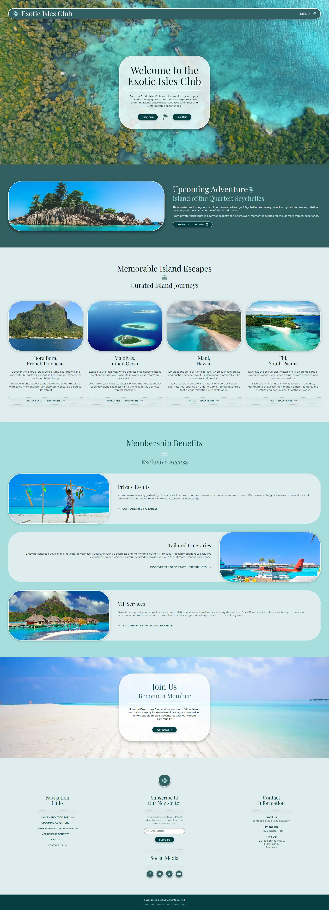

# Challenge Project: Responsive Club Website
## Front-End Engineer Path - Improved Styling with CSS

**Link to Live Site:** [Exotic Isles Club](https://armand-sa.github.io/Exotic-Isles-Club/)

____

### Overview

​This project is slightly different than others you have encountered thus far on **Codecademy**. Instead of a step-by-step tutorial, this project contains a series of open-ended requirements which describe the project you’ll be building. There are many possible ways to correctly fulfill all of these requirements, and you should expect to use the Internet, **Codecademy**, and other resources when you encounter a problem that you cannot easily solve.​

___

### Project Goals
In this project, you’ll be building your own club group page that will dynamically respond as you adjust the size of your screen!​

___

### Setup Instructions
If you choose to do this project on your computer instead of **Codecademy**, you can download what you’ll need by clicking the “Download” button below. If you need help setting up your computer, read our article about setting up a text editor for HTML/CSS development.

___

### Prerequisites

To complete this project, you should have completed the **Codecademy** Responsive Design course, or the same lessons in the Learn How to Build Websites Path.

___

### Project Requirements

In this project, you’ll build a webpage for a local club. You can base it on real-life organization you belong to or make one up! You’ll get to choose everything about your page: the club name, the page layout and styling, any images that you want to use, and more! You can check out our [example site](https://content.codecademy.com/PRO/independent-practice-projects/responsive-club-site/example-site/index.html?_gl=1*117lura*_gcl_aw*R0NMLjE3MjExMTU5MDEuQ2p3S0NBand0TmkwQmhBMUVpd0FXWmFBTkhjSnBIQnJBZEd1dGVPUG5laFpwaVdjaXhUcmJYSXkwS3VXTTE0RVV6Y2RodnhrbmwtaHZSb0N1X0lRQXZEX0J3RQ..*_gcl_au*MTU4MDYwOTc5MC4xNzIwNjA0ODU4*_ga*MTc4MTczMjIzMC4xNzIxMTE1MTc5*_ga_3LRZM6TM9L*MTcyNDQxNTQyMi41NS4xLjE3MjQ0MTU3ODMuNjAuMC4w) for some inspiration and experiment with what elements are responsive. We’ll provide the full code for this site in the solution section at the end of this project.

A helpful resource for finding beautiful images for your sites is Unsplash.

Your project should demonstrate many of the responsive design tools you learned. In our example project, we use percentages and relative units, such as `em` and `rem`, in our CSS to size and position page elements. We also made our website responsive by incorporating media queries to resize elements based on the size of the screen.

Possible responsive design concepts to demonstrate:​
- Making images toggle to certain percentages in terms of `width` after a certain minimum screen size.
- Using a `@media` rule to change page layout and behavior based on size breakpoints.
- Employing responsive units `em` and `rem` to size and space elements with `width` and `padding`.

___

### Project Solution

Great work! Visit our forums to compare your project to our sample solution code. You can also learn how to host your own solution on GitHub so you can share it with other learners!

Remember, this is just one possible solution. Your own project may be coded totally differently, have more or less content, and look totally different! We’re providing our solution for you get a sense of one way to use responsive units and media queries to affect page layout. There are multiple ways to solve these projects, and you’ll learn more by seeing others’ code.